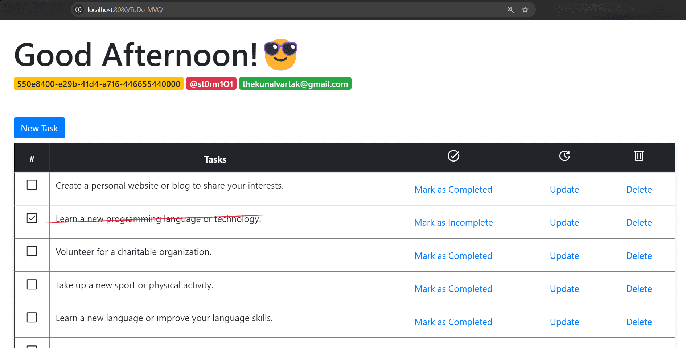

# ToDo-MVC Application

Welcome to the **ToDo-MVC Application** – a simple yet functional task management system built using Java, JSP, and Spring MVC. This application allows users to manage their daily tasks efficiently with features like task addition, updates, and deletion. The intuitive interface and user-friendly experience are designed to help you keep track of your to-dos effortlessly.

## Screenshots

Below are some screenshots of the ToDo-MVC application:

#### Dashboard



*Description: The main dashboard displaying the list of tasks with options to add, update, and delete tasks.*

#### CRUD Operations (Task Modal)


*Description: The application features modals for efficiently managing tasks, including marking an existing task as complete, adding new tasks, updating existing tasks, and deleting tasks.*

## Features

- **Task Management**: Add, update, complete, and delete tasks.
- **Dynamic Greeting**: Customized greetings based on the time of day. Users will receive a friendly greeting such as "Good Morning," "Good Afternoon," or "Good Evening" depending on when they access the application.
- **Responsive Design**: Built with Bootstrap for a mobile-friendly experience.
- **Interactive Modals**: Use modals for creating and updating tasks.
- **JavaServer Pages (JSP)**: Dynamic content generation using JSP with JSTL support.
- **Spring MVC**: A lightweight framework to handle your requests and manage your data.

## Technologies Used

- **Java**: Core language used for backend logic.
- **Spring MVC**: Framework used for handling requests and managing data.
- **JSP**: For dynamic page content generation.
- **Bootstrap**: For styling and responsive design.
- **jQuery**: For handling frontend events.
- **JSTL**: To simplify the usage of common tasks in JSP.

## Project Structure

```
src/
├── main/
│   ├── java/
│   │   └── com/
│   │       └── github/
│   │           └── st0rm1O1/
│   │               ├── controller/
│   │               │   └── ToDoController.java
│   │               ├── model/
│   │               │   ├── ToDoModel.java
│   │               │   └── UserModel.java
│   │               └── service/
│   │                   └── ToDoService.java
│   └── webapp/
│       ├── WEB-INF/
│       │   ├── js/
│       │   │   └── vanilla-tilt.js
│       │   ├── jsp/
│       │   │   └── index.jsp
│       │   ├── spring-servlet.xml
│       │   └── web.xml
└── test/
```

### Key Components

1. **index.jsp**: The main JSP page displaying the tasks and the UI.
2. **ToDoController.java**: Handles all the incoming requests related to tasks.
3. **ToDoModel.java**: Represents a task with attributes like ID, description, and completion status.
4. **UserModel.java**: Represents user data within the application.

## Getting Started

### Prerequisites

- **Java 8+**
- **Maven**
- **Spring Framework**
- **Tomcat Server**

### Installation

1. **Clone the repository**:
   ```bash
   git clone https://github.com/your-repo/ToDo-MVC.git
   ```

2. **Navigate to the project directory**:
   ```bash
   cd ToDo-MVC
   ```

3. **Build the project**:
   ```bash
   mvn clean install
   ```

4. **Deploy on Tomcat**:
    - Copy the generated `.war` file from the `target` directory to the `webapps` directory of your Tomcat server.
    - Start the Tomcat server.

5. **Access the application**:
    - Open your browser and navigate to `http://localhost:8080/ToDo-MVC`.

### Usage

1. **Adding a Task**:
    - Click on "New Task" to open the modal.
    - Enter the task description and hit "Create".

2. **Updating a Task**:
    - Click on the "Update" button next to the task.
    - Modify the task description and hit "Update".

3. **Deleting a Task**:
    - Click on the "Delete" button next to the task to remove it.

4. **Marking Tasks as Complete/Incomplete**:
    - Toggle the completion status by clicking on the "Mark as Completed" or "Mark as Incomplete" links.

### Customization

- **Styling**: You can customize the look and feel by modifying the Bootstrap classes and custom CSS in the `index.jsp` file.
- **Task Initialization**: Modify the initial tasks in the `ToDoController.java` class inside the `init()` method.

### Contributing

If you'd like to contribute, please fork the repository and use a feature branch. Pull requests are welcome.

### License

This project is licensed under the GPL-3.0 License.

### Contact

For any inquiries or issues, feel free to reach out:

- **Author**: Kunal Vinod Vartak
- **Email**: thekunalvartak@gmail.com
- **GitHub**: [st0rm1O1](https://github.com/st0rm1O1)

---